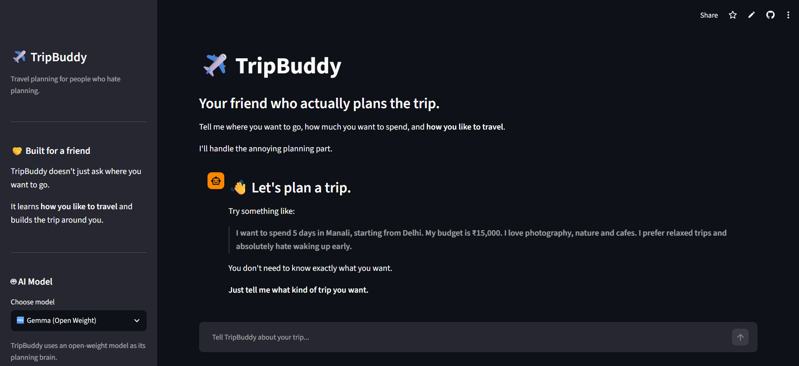

# ✈️ TripBuddy — AI Travel Planning Agent

<p align="center">
  
  
  
  
  
  
  
  
  
  
  
</p>

**Your friend who actually plans the trip.**

TripBuddy is a personalized, multi-agent AI travel planner that turns a simple natural-language request into a complete travel plan — including flights, accommodation, activities, restaurants, transportation, and a day-by-day itinerary.

Built with **LangGraph**, **LangChain**, **OpenRouter**, **Tavily**, **OpenStreetMap**, and **Streamlit**.

---

## 🎥 Demo


---

## 🌍 What is TripBuddy?
Planning a trip usually means jumping between flight websites, hotel platforms, maps, blogs, and dozens of tabs.  
TripBuddy brings that process into one place.

Just describe your trip naturally:

> *"I want to spend 5 days in Manali starting from Delhi. My budget is ₹15,000. I love photography, nature and cafes, and I hate waking up early."*

TripBuddy coordinates multiple specialist AI agents to turn that request into a personalized travel plan.

---

## 🧠 How It Works
TripBuddy uses a **LangGraph `StateGraph`** to coordinate several specialized agents.

```
                         USER REQUEST
                              │
                              ▼
                  ┌─────────────────────┐
                  │    ORCHESTRATOR     │
                  │                     │
                  │ Extracts:           │
                  │ • Destination       │
                  │ • Duration          │
                  │ • Budget            │
                  │ • Interests         │
                  │ • Origin            │
                  └──────────┬──────────┘
                             │
             ┌───────────────┼───────────────┐
             ▼               ▼               ▼
      ┌────────────┐  ┌────────────┐  ┌────────────────┐
      │   FLIGHT   │  │   HOTEL    │  │   ITINERARY    │
      │   AGENT    │  │   AGENT    │  │     AGENT      │
      │            │  │            │  │                │
      │ Tavily     │  │ Tavily     │  │ Tavily         │
      │ Search     │  │ Search     │  │ + Nominatim    │
      └─────┬──────┘  └─────┬──────┘  └───────┬────────┘
            │               │                  │
            └───────────────┼──────────────────┘
                            ▼
                  ┌─────────────────────┐
                  │     SYNTHESIZER     │
                  │                     │
                  │ Combines all agent  │
                  │ results into one    │
                  │ personalized plan   │
                  └──────────┬──────────┘
                             │
                             ▼
                     ✈️ COMPLETE TRIP
```

### Agent Responsibilities

| Agent | Responsibility | Tools |
| :--- | :--- | :--- |
| 🧠 **Orchestrator** | Understands and extracts trip requirements | Python parsing |
| ✈️ **Flight Agent** | Finds routes, airlines, prices, and booking information | Tavily |
| 🏨 **Hotel Agent** | Finds accommodation across different budgets | Tavily |
| 🗺️ **Itinerary Agent** | Creates the day-by-day travel plan | Tavily + Nominatim |
| ✨ **Synthesizer** | Combines everything into the final response | LLM |

---

## ✨ Features
* 🧠 **Multi-agent architecture** powered by LangGraph
* 💬 **Natural-language trip planning**
* ✈️ **Flight research** with airline, route, and price information
* 🏨 **Accommodation research** across different budgets
* 🗺️ **Personalized day-by-day itineraries**
* 🍜 **Restaurant and food recommendations**
* 🚆 **Local transportation suggestions**
* 🔎 **Real-time web research** through Tavily
* 📍 **Location discovery** through OpenStreetMap/Nominatim
* 🤖 **Multi-model LLM support** through OpenRouter
* 🆓 **Free model support** for experimentation and demos
* 📊 **Budget-aware recommendations**
* 💻 **Streamlit chat interface**
* 🔄 **Conversation history**
* 🗑️ **Clear Trip functionality**
* ⚡ **Live workflow progress indicators**

---

## 🤖 Supported Models
TripBuddy uses **OpenRouter** as its LLM gateway, allowing different models to be selected without changing the application architecture.

Example models configured in the project include:
* `openai/gpt-oss-20b`
* `google/gemma-4-31b-it`
* `openrouter/free`
* NVIDIA Nemotron models
* Google Gemini
* OpenAI models
* Anthropic Claude

> **Note:** Model availability and free-tier status can change over time. Check OpenRouter for the currently available models.

---

## 🛠️ Tech Stack

| Layer | Technology |
| :--- | :--- |
| Agent orchestration | LangGraph |
| LLM framework | LangChain |
| LLM gateway | OpenRouter |
| Web search | Tavily Search API |
| Location data | OpenStreetMap / Nominatim |
| Geocoding | geopy |
| Frontend | Streamlit |
| Language | Python |
| Testing | pytest |

---

## 📁 Project Structure

```text
Travel_Planner_Agent/
│
├── Travel Agent V1/
│   ├── app.py                    # Streamlit application
│   ├── config.py                 # LLM/OpenRouter configuration
│   ├── requirements.txt          # Python dependencies
│   ├── .env.example              # Environment variable template
│   │
│   └── graph/
│       ├── __init__.py
│       ├── state.py              # TravelPlanState definition
│       ├── nodes.py              # Agent node implementations
│       ├── tools.py              # Tavily + location tools
│       └── workflow.py           # LangGraph workflow
│
├── tests/
│   ├── test_orchestrator.py      # Orchestrator tests
│   └── test_workflow.py          # Workflow tests
│
├── assets/
│   └── demo.png                  # Application screenshot
│
├── requirements.txt              # Root dependencies
├── .env.example                  # Root environment template
├── README.md
└── LICENSE
```

---

## 🚀 Getting Started

### Prerequisites
Make sure you have:
* Python 3.10+
* Git
* An OpenRouter API key
* A Tavily API key

### 1. Clone the repository
```bash
git clone https://github.com/aryan6002261/trip-buddy.git
cd trip-buddy
```

### 2. Create a virtual environment

**Windows:**
```cmd
python -m venv venv
venv\Scripts\activate
```

**macOS / Linux:**
```bash
python3 -m venv venv
source venv/bin/activate
```

### 3. Install dependencies
```bash
pip install -r requirements.txt
```

If you're working specifically inside the V1 directory:
```bash
cd "Travel Agent V1"
pip install -r requirements.txt
```

### 4. Configure API keys
Create a `.env` file based on `.env.example`:

```env
OPENROUTER_API_KEY=your_openrouter_api_key
TAVILY_API_KEY=your_tavily_api_key
```

#### API Keys Overview

| Key | Purpose | Get it from |
| :--- | :--- | :--- |
| `OPENROUTER_API_KEY` | LLM access | OpenRouter |
| `TAVILY_API_KEY` | Real-time web search | Tavily |

---

## ▶️ Running TripBuddy

From the project directory:

```bash
cd "Travel Agent V1"
streamlit run app.py
```

Streamlit will provide a local URL, usually: `http://localhost:8501`. Open it in your browser and start planning!

---

## 💬 Example Prompts

TripBuddy understands natural language, so you don't need a strict format.

* 🏔️ **Weekend Adventure:**
  > *"Plan a weekend trip to Rishikesh from Delhi. My budget is ₹8,000. I want nature, adventure and good cafes."*
* 🏖️ **Relaxed Vacation:**
  > *"Plan a 5-day trip to Bali for around $1,500. I prefer beaches, cafes and relaxed days. I don't want a packed schedule."*
* 🏛️ **Culture & Food:**
  > *"I'm going to Rome for 6 days with a $2,000 budget. I'm interested in history, architecture and Italian food."*
* 📸 **Personalized Trip:**
  > *"I want to spend 5 days in Manali starting from Delhi. My budget is ₹15,000. I love photography, nature and cafes, and I hate waking up early."*

---

## 📋 What TripBuddy Generates

A typical generated plan can include:

* ✈️ **Flights:** Route options, airlines, estimated prices, direct vs. connecting options, flight duration, booking considerations.
* 🏨 **Accommodation:** Budget, mid-range, and luxury options, recommended neighborhoods, estimated nightly prices, accommodation budget.
* 🗺️ **Itinerary:** Morning activities, lunch recommendations, afternoon activities, dinner recommendations, evening options, transportation suggestions, estimated daily spending.
* 💡 **Travel Tips:** Packing suggestions, local transportation, cultural considerations, booking tips, practical destination advice.

---

## 🧩 LangGraph Workflow

The workflow is implemented using a typed shared state: `TravelPlanState`.

The state contains information such as:
* Input: `user_request`, `destination`, `duration`, `budget`, `interests`, `origin`
* Agent Outputs: `flight_info`, `hotel_info`, `itinerary_info`
* Result: `final_plan`
* Metadata: `errors`, `current_node`, `nodes_completed`

Each node receives the current state and returns updates to it. The final synthesizer combines the specialist outputs into a single Markdown travel plan.

---

## 🔍 Real-Time Information

TripBuddy uses **Tavily Search** to research current web information rather than relying entirely on the model's static knowledge. This allows agents to search for:
* Flight routes & airlines
* Hotels & stay options
* Attractions & local activities
* Restaurants & travel guides

Location-based discovery is additionally supported through **OpenStreetMap / Nominatim**.

> **Disclaimer:** Prices, availability, schedules, and other travel information can change. Always verify important details before booking.

---

## 🧪 Running Tests

Install `pytest`:
```bash
pip install pytest
```

Run the test suite:
```bash
python -m pytest tests/ -v
```

The tests cover areas such as user-request parsing, destination/duration/budget extraction, interest detection, workflow construction, and graph node wiring.

---

## ⚙️ Configuration

The main model configuration lives in:
`Travel Agent V1/config.py`

The application uses `ChatOpenAI` pointed to OpenRouter's API endpoint (`https://openrouter.ai/api/v1`). This makes it possible to switch between supported OpenRouter models without rewriting the agent implementation.

---

## 🗺 Roadmap

Potential future improvements:
- [ ] True parallel execution of specialist agents
- [ ] Live flight APIs instead of search-based estimates
- [ ] Live hotel availability and booking integrations
- [ ] Interactive maps & trip cost visualization
- [ ] Multi-city itinerary optimization
- [ ] Calendar & PDF itinerary export
- [ ] Weather-aware planning & visa requirement lookup
- [ ] User profiles and persistent travel preferences
- [ ] Mobile-friendly UI & budget optimization

---

## ⚠️️ Disclaimer

TripBuddy is an AI-assisted travel planning tool. Travel information such as prices, availability, opening hours, schedules, and recommendations may change. Search results can also be incomplete or inaccurate.

Always verify important information directly with airlines, accommodation providers, attractions, and relevant official sources before making bookings or traveling.

---

## 🤝 Contributing

Contributions, ideas, and improvements are welcome!

1. Fork the repository
2. Create a feature branch: `git checkout -b feature/your-feature`
3. Make your changes and commit: `git commit -m "Add your feature"`
4. Push to the branch: `git push origin feature/your-feature`
5. Open a Pull Request

---

## 👨‍💻 Built With

Built with curiosity, caffeine, and a desire to make travel planning less painful. ☕✈️

**TripBuddy** — *Your friend who actually plans the trip.*